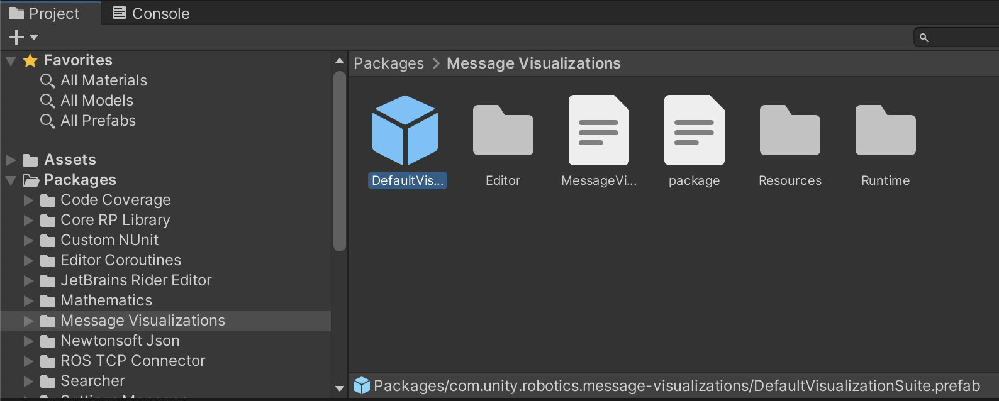
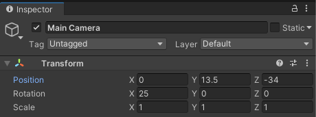

# Visualizing rosbags in Unity


## Introduction

There are a variety of reasons that visualizations can be useful in a simulation, both in realtime and in playback. Seeing the data being sent and received offers more information and a better understanding of the state of the simulation, offering insights into data like realtime sensor readings and control signals. Visualizations also enable users to more efficiently debug their robotic simulations with the ability to visually verify coordinate frames, object scaling, offsets, and more.

This tutorial will show you how to show and customize visualizations for rosbag playback, including steps from installing the Message Visualizations package in your Unity project to customizing the visualization suite.

> Please note that while the this tutorial targets steps for ROS 1, the Message Visualizations package is also compatible with ROS 2.

<!-- TODO: For an example of visualizing data in realtime, check out... [nav2 demo?] -->

**Table of Contents**
- [Introduction](#introduction)
- [Prerequisites](#prerequisites)
- [Adding Visualizations](#adding-visualizations)
- [Visualizing Topics](#visualizing-topics)
- [Point Clouds](#point-clouds)
- [More with Message Visualizations](#more-with-message-visualizations)

---

## Prerequisites
- You will need to have ROS—Unity Integration set up in your project in order to send and receive ROS messages, including rosbag playback. If this is not yet set up, follow the steps [here](../ros_unity_integration/README.md). These steps assume you are continuing to use the project created in the [Setup](../ros_unity_integration/setup.md) step, but these steps can also be done in any Unity project with ROS integration.
- [TEMP] This package currently requires the URDF-Importer package to be installed in the Unity project as well. Follow the [Installation Steps](../quick_setup.md) for URDF-Importer.
- This tutorial will display and customize visualizations for odometry and point cloud data, provided by a demo rosbag. In your ROS environment, download this rosbag from [here](https://open-source-webviz-ui.s3.amazonaws.com/demo.bag), or use the `wget` command:
    ```bash
    wget https://open-source-webviz-ui.s3.amazonaws.com/demo.bag
    ```
    > Please note that while the target rosbag is compatible with ROS 1, the Message Visualizations package is also compatible with ROS 2.

## Adding Visualizations

1. From the Unity Hub, open your Unity project with ROS integration.

2. If you have not already added the Message Visualizations package in your Unity project, follow the [Installation Steps](../quick_setup.md).

3. This package contains a `DefaultVisualizationSuite` prefab that provides visualizer components for many common ROS message types, organized in the hierarchy by package. These components control how messages are displayed in the Unity scene.

    To add the default visualization suite, open the Unity scene that you would like add message visualizations to. In the Project window, expand and select `Packages/Message Visualizations`. Select the `DefaultVisualizationSuite` (indicated by the blue cube Prefab icon) and drag it into your scene Hierarchy.

    

4. We will need to adjust the Main Camera in order to have a better view of the drawings in Game view. In the Hierarchy, select the `Main Camera`. In its Inspector window, set the Transform's position to `(0, 13.5, -34)`, and its rotation to `(25, 0, 0)`.

    

5. In your ROS environment, start the default server endpoint if it is not already running:

    ```
    rosrun ros_tcp_endpoint default_server_endpoint.py
    ```

    > If you have not yet set up the ROS–Unity integration, you can follow the steps [here](../ros_unity_integration/setup.md) to do so now.

6. In Unity, enter Play mode. The heads-up display (HUD) panel in the top left corner of the Game view indicates a successful connection via the colored arrows. If the HUD is not visible, ensure your connection throws no errors, and that `Show HUD` in the ROS Settings is on.

    > If you encounter connection issues, please refer to the [Networking Guide](../ros_unity_integration/network.md).

7. Once connected, you may begin sending and receiving ROS messages as usual. For this tutorial, we will be playing back the downloaded rosbag to visually inspect the recorded data. In a new terminal in your ROS workspace, navigate to the directory where you saved the bag file, and run the following command to begin playback on loop:

    ```
    rosbag play -l demo.bag
    ```

## Visualizing Topics

1. Topics will, by default, populate in the HUD panel's `Topics` list. Let's begin with visualizing a [nav_msgs/Odometry](http://docs.ros.org/en/api/nav_msgs/html/msg/Odometry.html) message. As this message *represents an estimate of a position and velocity in free space*, visualizing the odometry message can be useful for understanding the robot's sense of locality during playback.

    In Unity, select the `Topics` tab in the HUD. Click the `/gps/rtkfix` topic name (corresponding to the GPS's fixed real-time kinematics) to toggle both the `UI` and `Viz` options. Alternatively, you can select each individual toggle. `UI` toggles a GUI window that displays a text-formatted version of the message. `Viz` toggles the 3D drawing.

    

9. You should now see a new `UI` window labeled with the `/gps/rtkfix` topic in your Game view, populated with the `nav_msgs/Odometry` data being published.

    You can click and drag the edges of the UI to adjust the size and placement of the topic's window. Additionally, the `Viz` is being drawn and updated in the scene as the rosbag plays!

    > Your UI layout and visualized topics are automatically saved to your local machine, which will be loaded next time you enter Play mode. You can also specifically export and load layouts from your filesystem using the HUD's `Layout` tab. Learn more about this feature in the [TEMP link] [Usage Documentation](https://github.com/Unity-Technologies/ROS-TCP-Connector/blob/amanda/default-tutorial/com.unity.robotics.message-visualizations/Documentation~/README.md).

    However, you'll notice that the odometry drawing is hard to see from this camera distance--move onto the next step to begin customizing this visualization.

10. Exit Play mode. In the scene Hierarchy, expand the `DefaultVisualizationSuite`. Select the `Nav` child object (for nav_msgs). In its Inspector window, scroll down until you find the `Odometry Default Visualizer`.

    Increase the `Thickness` to `0.1`, and change the color--we chose yellow (and don't forget to increase the color's Alpha value to 255!).

    

11. Enter Play mode again. Now it's much easier to see the odometry visualization!

    

You've successfully set up visualizations! To proceed with customizing a point cloud visualization, proceed to the [Point Clouds](#point-clouds) section.

## Point Clouds

Point cloud visualizations provide valuable insight into sensor readings. Using the Message Visualizations package, these visualizations are highly customizable. This section will walk through customization options for a sensor_msgs/PointCloud2 visualization for your rosbag playback.

1. If you have not already, follow the [Prerequisites](#prerequisites) and [Adding Visualizations](#adding-visualizations) steps to set up the visualizations suite. Exit Play mode if it is still running.

2. We will be visualizing lidar data from the `/velodyne_points` topic for this tutorial--but we need to find the message type in order to modify the default visualizer for it!

    In your ROS workspace where your sample rosbag is saved, run `rosbag info demo.bag` to view more information about the topic names and types in the rosbag--in this case, we know its ROS message type is sensor_msgs/PointCloud2.

3. In the scene Hierarchy, once again expand the `DefaultVisualizationSuite`. This time, select the `Sensor` child object (for sensor_msgs). In its Inspector window, scroll down until you find the `Point Cloud 2 Default Visualizer`.

4. In the `Topic` field, enter `/velodyne_points`.

    > While the odometry visualization was created based on its ROS message type, you can explicitly set the topic of each visualization to apply customizations to messages on that specific topic.

1. For messages with stamped headers, there is an option to customize the coordinate frame tracking per visualization. This is set via the `TF Tracking Settings`: click it to expand the options. To create each drawing as children of respective *frame_id* GameObjects, change the `Type` to `Track Latest`. The `TF Topic` should be left as default `/tf`.

    > Learn more about TF tracking options in the [TEMP link] [Usage Documentation](https://github.com/Unity-Technologies/ROS-TCP-Connector/blob/amanda/default-tutorial/com.unity.robotics.message-visualizations/Documentation~/README.md).

2. In your ROS environment, start the default server endpoint and the looped rosbag playback in another terminal if they are not already running:

    ```bash
    # Terminal 1
    rosrun ros_tcp_endpoint default_server_endpoint.py
    ```

    ```bash
    # Terminal 2
    rosbag play -l demo.bag
    ```

3. In Unity, enter Play mode. Open the `Topics` tab, and click the `/velodyne_points` topic to turn on both the `UI` and `Viz`. The point cloud message should now be drawing and updating!

    > Because the TF Tracking Type is set to Track Latest, in your scene Hierarchy, you can expand the `velodyne` frame GameObject all the way down to find the `Drawing/PointCloud` object.

4.  We can continue to customize this visualization during runtime. Return to `DefaultVisualizationSuite/Sensor` and scroll back down to the `Point Cloud 2 Default Visualizer`.

    In the Inspector, turn on `Use size channel`. This will add range fields and a slider bar to the Inspector. Leave the `Min size range` to 0, and set the `Max size range` to 300. These values clamp the two ends of the slider range to allow more or less granularity when changing the values on slider.

    Finally, expand the dropdown for `Size channel name` and select `intensity`. This corresponds to the intensity channel in the `/velodyne_points` message, and will now apply size scaling to each point based on the associated intensity reading.

    You may drag the size slider along this range to modify the scaling range of each point, or drag each end of the slider bar. A range approximately between 0-200 works well for this data.

    

5.  Now, turn on the `Use color channel` toggle. The `Color mode` can be left as HSV--this allows you to select one channel for color assignments.

    Under `Hue channel name`, expand the dropdown and select `ring`, corresponding to the ring channel in the `/velodyne_points` message. We know that the `ring` channel defines each of the lidar's 32 lasers, so change the `Max color range` to 32.

    Drag the rightmost end of the color slider bar down so it clamps to 32 as well, leaving your color range clamped between 0-32.

    

6.  You now have a fully configured PointCloud2 visualization! You can learn more about other point cloud-type visualizations (such as LaserScan) in the [TEMP link] [Usage Documentation](https://github.com/Unity-Technologies/ROS-TCP-Connector/blob/amanda/default-tutorial/com.unity.robotics.message-visualizations/Documentation~/README.md).

    

## More with Message Visualizations

You can proceed to the next tutorial, [TEMP link] [Visualizing Custom Messages]().

To learn more about using the Message Visualizations package, visit the package [TEMP link] [documentation](https://github.com/Unity-Technologies/ROS-TCP-Connector/blob/amanda/default-tutorial/com.unity.robotics.message-visualizations/Documentation~/README.md).