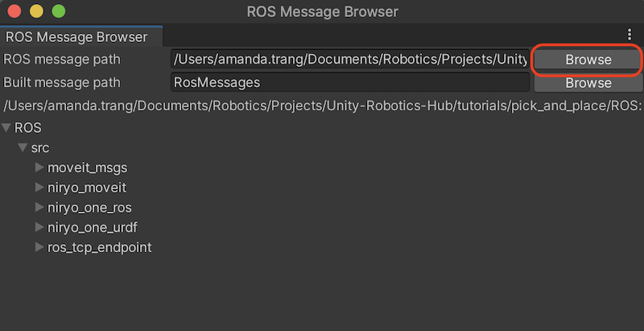
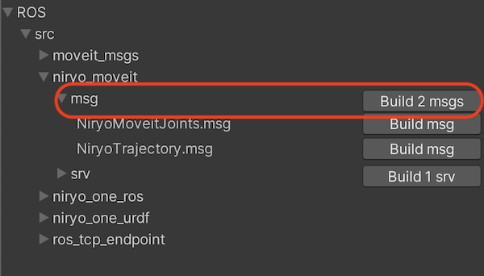
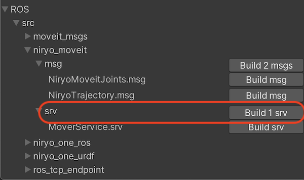
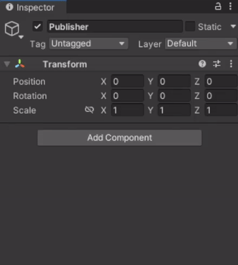
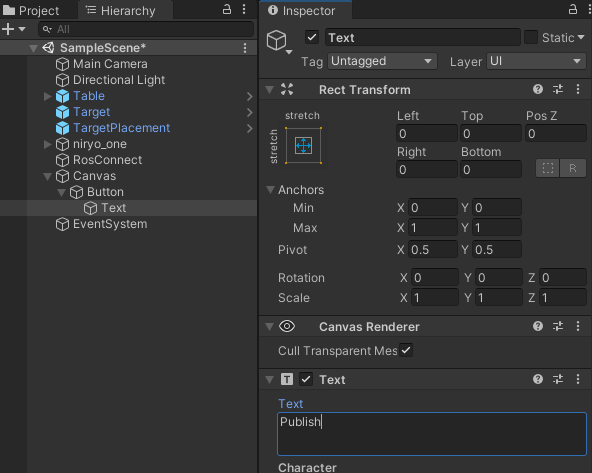

# Pick-and-Place Tutorial: Part 2

The steps in this tutorial will explain how to configure your ROS workspace for this project, but check out the ROS Wiki's [Start Guide](http://wiki.ros.org/ROS/StartGuide) if you'd like to learn more about getting started with ROS.

Steps covered in this tutorial include creating a TCP connection between Unity and ROS, generating C# scripts from a ROS message, and publishing and subscribing to a ROS Topic. These steps are adapted from the [ROS–Unity Integration Tutorials](../ros_unity_integration/README.md).

**Table of Contents**
  - [The Unity Side](#the-unity-side)
  - [The ROS side](#the-ros-side)
  - [Troubleshooting](#troubleshooting)
  - [Resources](#resources)
  - [Proceed to Part 3](#proceed-to-part-3)

---

## Part 2: ROS–Unity Integration


**Quick Description:**

To enable communication between Unity and ROS, a TCP endpoint running as a ROS node handles all message passing. On the Unity side, a `ROSConnection` component provides the necessary functions to publish, subscribe, or call a service using the TCP endpoint ROS node. The ROS messages being passed between Unity and ROS are expected to be serialized exactly as ROS serializes them internally. This is achieved with the MessageGeneration plugin which generates C# classes, including serialization and deserialization functions, from ROS messages.

---

## The Unity Side

1. If you have not already completed the steps in [Part 0](0_ros_setup.md) to set up your ROS workspace and [Part 1](1_urdf.md) to set up the Unity project, do so now. 

1. If the PickAndPlaceProject Unity project is not already open, select and open it from the Unity Hub.

   > Note: The Package Manager automatically checked out and built the ROS-TCP-Connection package in this project. You can verify this now by looking for `Packages/ROS-TCP-Connector` in the Project window or by opening the Package Manager window. See the [Quick Setup](../quick_setup.md) steps for adding this package to your own project.

   > The ROS-TCP-Connector package includes two pieces: TcpConnector, which contains the `ROSConnection` script described above, and MessageGeneration, which generates C# scripts from ROS msg and srv files.

   > Using this MessageGeneration component, three C# message scripts will be generated. Like their ROS msg counterparts, these scripts define the data values and contents that will be passed between Unity and ROS.

   > Note: Read more about the ROS msg [here](http://wiki.ros.org/msg).

   > Note: Read more about the ROS srv [here](http://wiki.ros.org/srv).

1. We will start with generating the MoveItMsg: RobotTrajectory. This file describes the trajectory contents that will be used in the sent and received trajectory messages.

   Select `Robotics -> Generate ROS Messages...` from the top menu bar.

   

   In the ROS Message Browser window, click `Browse` next to the ROS message path. Navigate to and select the ROS directory of this cloned repository (`Unity-Robotics-Hub/tutorials/pick_and_place/ROS/`). This window will populate with all msg and srv files found in this directory. 
   
   

   > Note: If any of these ROS directories appear to be empty, you can run the command `git submodule update --init --recursive` to download the packages via Git submodules.
   
   Under `ROS/src/moveit_msgs/msg`, scroll to `RobotTrajectory.msg`, and click its `Build msg` button. The button text will change to "Rebuild msg" when it has finished building.

   

	- One new C# script should populate the `Assets/RosMessages/Moveit/msg` directory: MRobotTrajectory. This name is the same as the message you built, with an "M" prefix (for message).
  
1. Next, the custom message scripts for this tutorial will need to be generated. 

   Still in the ROS Message Browser window, expand `ROS/src/niryo_moveit/msg` to view the msg files listed. Next to msg, click `Build 2 msgs`.

   
   
	- Two new C# scripts should populate the `Assets/RosMessages/NiryoMoveit/msg` directory: MNiryoMoveitJoints and MNiryoTrajectory. MNiryoMoveitJoints describes a value for each joint in the Niryo arm as well as poses for the target object and target goal. MNiryoTrajectory describes a list of RobotTrajectory values, which will hold the calculated trajectories for the pick-and-place task.
  
   > MessageGeneration generates a C# class from a ROS msg file with protections for use of C# reserved keywords and conversion to C# datatypes. Learn more about [ROS Messages](https://wiki.ros.org/Messages).

1. Finally, now that the messages have been generated, we will create the service for moving the robot. 

   Still in the ROS Message Browser window, expand `ROS/src/niryo_moveit/srv` to view the srv file listed. Next to srv, click `Build 1 srv`. 

   

   - Two new C# scripts should populate the `Assets/RosMessages/NiryoMoveit/srv` directory: MMoverServiceRequest and MMoverServiceResponse. These files describe the expected input and output formats for the service requests and responses when calculating trajectories. 
   
   > MessageGeneration generates two C# classes, a request and response, from a ROS srv file with protections for use of C# reserved keywords and conversion to C# datatypes. Learn more about [ROS Services](https://wiki.ros.org/Services).

   You can now close the ROS Message Browser window.

1. In this repo, navigate to `Unity-Robotics-Hub/tutorials/pick_and_place`. Select and copy the `Scripts` folder and contents into the `Assets` folder of your Unity project. You should now find two C# scripts in your project's `Assets/Scripts`.

   > Note: The SourceDestinationPublisher script is one of the included files. This script will communicate with ROS, grabbing the positions of the target and destination objects and sending it to the ROS Topic `"SourceDestination_input"`. The `Publish()` function is defined as follows:

   ```csharp
   public void Publish()
   {
      MNiryoMoveitJoints sourceDestinationMessage = new MNiryoMoveitJoints();

      sourceDestinationMessage.joint_00 = jointArticulationBodies[0].xDrive.target;
      sourceDestinationMessage.joint_01 = jointArticulationBodies[1].xDrive.target;
      sourceDestinationMessage.joint_02 = jointArticulationBodies[2].xDrive.target;
      sourceDestinationMessage.joint_03 = jointArticulationBodies[3].xDrive.target;
      sourceDestinationMessage.joint_04 = jointArticulationBodies[4].xDrive.target;
      sourceDestinationMessage.joint_05 = jointArticulationBodies[5].xDrive.target;

      // Pick Pose
      sourceDestinationMessage.pick_pose = new MPose
      {
         position = target.transform.position.To<FLU>(),
         // The hardcoded x/z angles assure that the gripper is always positioned above the target cube before grasping.
         orientation = Quaternion.Euler(90, target.transform.eulerAngles.y, 0).To<FLU>()
      };

      // Place Pose
      sourceDestinationMessage.place_pose = new MPose
      {
         position = targetPlacement.transform.position.To<FLU>(),
         orientation = pickOrientation.To<FLU>()
      };

      // Finally send the message to server_endpoint.py running in ROS
      ros.Send(topicName, sourceDestinationMessage);
   }
   ```

   > This function first takes in the current joint target values. Then, it grabs the poses of the `target` and the `targetPlacement` objects, adds them to the newly created message `sourceDestinationMessage`, and calls `Send()` to send this information to the ROS topic `topicName` (defined as `"SourceDestination_input"`). 

   > Note: Going from Unity world space to ROS world space requires a conversion. Unity's `(x,y,z)` is equivalent to the ROS `(z,-x,y)` coordinate. These conversions are provided via the [ROSGeometry component](https://github.com/Unity-Technologies/ROS-TCP-Connector/blob/main/ROSGeometry.md) in the ROS-TCP-Connector package.

1. Return to the Unity Editor. Now that the message contents have been defined and the publisher script added, it needs to be added to the Unity world to run its functionality. 

   Right click in the Hierarchy window and select "Create Empty" to add a new empty GameObject. Name it `Publisher`. Add the newly created SourceDestinationPublisher component to the Publisher GameObject by selecting the Publisher object. Click "Add Component" in the Inspector, and begin typing "SourceDestinationPublisher." Select the component when it appears.       
   > Note: Alternatively, you can drag the script from the Project window onto the Publisher object in the Hierarchy window.

   

1. Note that this component shows empty member variables in the Inspector window, which need to be assigned. 

   Select the Target object in the Hierarchy and assign it to the `Target` field in the Publisher. Similarly, assign the TargetPlacement object to the `TargetPlacement` field. Assign the niryo_one robot to the `Niryo One` field.

   

1. Next, the ROS TCP connection needs to be created. Select `Robotics -> ROS Settings` from the top menu bar. 

   In the ROS Settings window, the `ROS IP Address` should be the IP address of your ROS machine (*not* the one running Unity).

   - Find the IP address of your ROS machine. In Ubuntu, open a terminal window, and enter `hostname -I`.

   - If you are **not** running ROS services in a Docker container, replace the `ROS IP Address` value with the IP address of your ROS machine. Ensure that the `Host Port` is set to `10000`.

   - If you **are** running ROS services in a Docker container, fill `ROS IP Address` with the loopback IP address `127.0.0.1` and the `Override Unity IP Address` as your local machine's IP address. Otherwise, leave the `Override Unity IP Address` field empty.

   

   Opening the ROS Settings has created a ROSConnectionPrefab in `Assets/Resources` with the user-input settings. When the static `ROSConnection.instance` is referenced in a script, if a `ROSConnection` instance is not already present, the prefab will be instantiated in the Unity scene, and the connection will begin.
   
   > Note: While using the ROS Settings menu is the suggested workflow as of this version, you may still manually create a GameObject with an attached ROSConnection component.

1. Next, we will add a UI element that will allow user input to trigger the `Publish()` function. In the Hierarchy window, right click to add a new UI > Button. Note that this will create a new Canvas parent as well. 
	> Note: In the `Game` view, you will see the button appear in the bottom left corner as an overlay. In `Scene` view the button will be rendered on a canvas object that may not be visible.
   
   > Note: In case the Button does not start in the bottom left, it can be moved by setting the `Pos X` and `Pos Y` values in its Rect Transform component. For example, setting its Position to `(-200, -200, 0)` would set its position to the bottom right area of the screen. 
  
1. Select the newly made Button object, and scroll to see the Button component in the Inspector. Click the `+` button under the empty `OnClick()` header to add a new event. Select the `Publisher` object in the Hierarchy window and drag it into the new OnClick() event, where it says `None (Object)`. Click the dropdown where it says `No Function`. Select SourceDestinationPublisher > `Publish()`.

   

1. To change the text of the Button, expand the Button Hierarchy and select Text. Change the value in Text on the associated component.

   

---

## The ROS side

> Note: This project has been tested with Python 2 and ROS Melodic, as well as Python 3 and ROS Noetic.

Most of the ROS setup has been provided via the `niryo_moveit` package. This section will describe the `.launch` files and start the necessary ROS nodes for communication. If you have not already followed the steps in [Part 0](0_ros_setup.md) to set up your ROS workspace, do so now.

1. Open a terminal window in the ROS workspace. Once again, source the workspace. Then, run the following `roslaunch` in order to set the ROS parameters, start the server endpoint, and start the trajectory subscriber.

   ```bash
   roslaunch niryo_moveit part_2.launch
   ```

   > Note: Running `roslaunch` automatically starts [ROS Core](http://wiki.ros.org/roscore) if it is not already running. 

   > Note: This launch file has been copied below for reference. The server_endpoint and trajectory_subscriber nodes are launched from this file, and the ROS params (set up in [Part 0](0_ros_setup.md)) are loaded from this command. The launch files for this project are available in the package's `launch` directory, i.e. `src/niryo_moveit/launch/`.

   ```xml
   <launch>
      <rosparam file="$(find niryo_moveit)/config/params.yaml" command="load"/>
      <node name="server_endpoint" pkg="niryo_moveit" type="server_endpoint.py" args="--wait" output="screen" respawn="true" />
      <node name="trajectory_subscriber" pkg="niryo_moveit" type="trajectory_subscriber.py" args="--wait" output="screen"/>
   </launch>
   ```

   This launch will print various messages to the console, including the set parameters and the nodes launched. 
   
   Ensure that the `process[server_endpoint]` and `process[trajectory_subscriber]` were successfully started, and that a message similar to `[INFO] [1603488341.950794]: Starting server on 192.168.50.149:10000` is printed.

1. Return to Unity, and press Play. Click the UI Button in the Game view to call SourceDestinationPublisher's `Publish()` function, publishing the associated data to the ROS topic. View the terminal in which the `roslaunch` command is running. It should now print `I heard:` with the data.
  
ROS and Unity have now successfully connected!

   

---

## Troubleshooting
- If the error `[rosrun] Found the following, but they're either not files, or not executable: server_endpoint.py` appears, the Python script may need to be marked as executable via `chmod +x Unity-Robotics-Hub/tutorials/pick_and_place/ROS/src/niryo_moveit/scripts/server_endpoint.py`.

- `...failed because unknown error handler name 'rosmsg'` This is due to a bug in an outdated package version. Try running `sudo apt-get update && sudo apt-get upgrade` to upgrade.
  
- If Unity fails to find a network connection, ensure that the ROS IP address is entered correctly as the ROS IP Address in the RosConnect in Unity, and that the `src/niryo_moveit/config/params.yaml` values are set correctly. 

- If the ROS TCP handshake fails (e.g. `ROS-Unity server listening...` printed on the Unity side but no `ROS-Unity Handshake received` on the ROS side), the ROS IP may not have been set correctly in the params.yaml file. Try running `echo "ROS_IP: $(hostname -I)" > src/niryo_moveit/config/params.yaml` in a terminal from your ROS workspace.

---

## Resources

- More on [ROS Topics](http://wiki.ros.org/Topics)
- [ROS–Unity Integration Tutorials](../ros_unity_integration/README.md)
- [ROS TCP Connector](https://github.com/Unity-Technologies/ROS-TCP-Connector) package
- [TCP Endpoint](https://github.com/Unity-Technologies/ROS-TCP-Endpoint) package
- [Niryo One ROS stack](https://github.com/NiryoRobotics/niryo_one_ros)
- [MoveIt Msgs](https://github.com/ros-planning/moveit_msgs)
  
---

#### Proceed to [Part 3](3_pick_and_place.md).