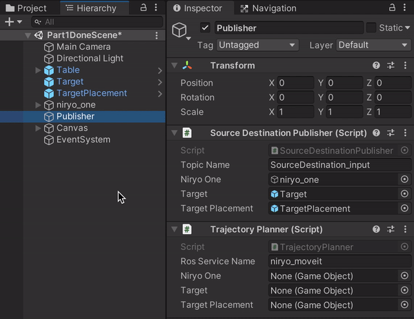
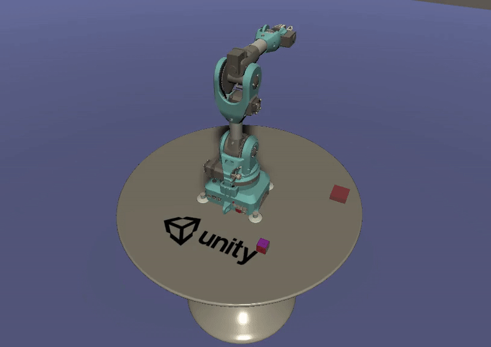

# Pick-and-Place Tutorial: Part 3

This part assumes that the previous two parts ([Part 1](1_urdf.md), [Part 2](2_ros_tcp.md)) have been completed.

Steps covered in this tutorial includes invoking a motion planning service in ROS, moving a Unity Articulation Body based on the calculated trajectory, and controlling a gripping tool to successfully grasp a cube.

**Table of Contents**
  - [The Unity Side](#the-unity-side)
  - [The ROS Side](#the-ros-side)
  - [ROS–Unity Communication](#rosunity-communication)
  - [Resources](#resources)
  - [Troubleshooting](#troubleshooting)
    - [Errors and Warnings](#errors-and-warnings)
    - [Hangs, Timeouts, and Freezes](#hangs-timeouts-and-freezes)
    - [Miscellaneous Issues](#miscellaneous-issues)

---

## Part 3: Pick-and-Place

## The Unity Side

1. If you have not already completed the steps in [Part 1](1_urdf.md) to set up the Unity project and [Part 2](2_ros_tcp.md) to integrate ROS with Unity, do so now. 

1. If the PickAndPlaceProject Unity project is not already open, select and open it from the Unity Hub.

    > Note the `Assets/Scripts/TrajectoryPlanner.cs` script. This is where all of the logic to invoke a motion planning service lives, as well as the logic to control the gripper end effector tool.

    > The UI button `OnClick` callback will be reassigned later in this tutorial to the following function, `PublishJoints`, as defined:

    ```csharp
    public void PublishJoints()
    {
        MoverServiceRequest request = new MoverServiceRequest();
        request.joints_input = CurrentJointConfig();
        
        // Pick Pose
        request.pick_pose = new RosMessageTypes.Geometry.Pose
        {
            position = (target.transform.position + pickPoseOffset).To<FLU>(),
            // The hardcoded x/z angles assure that the gripper is always positioned above the target cube before grasping.
            orientation = Quaternion.Euler(90, target.transform.eulerAngles.y, 0).To<FLU>()
        };

        // Place Pose
        request.place_pose = new RosMessageTypes.Geometry.Pose
        {
            position = (targetPlacement.transform.position + pickPoseOffset).To<FLU>(),
            orientation = pickOrientation.To<FLU>()
        };

        ros.SendServiceMessage<MoverServiceResponse>(rosServiceName, request, TrajectoryResponse);
    }

    void TrajectoryResponse(MoverServiceResponse response)
    {
        if (response.trajectories != null)
        {
            Debug.Log("Trajectory returned.");
            StartCoroutine(ExecuteTrajectories(response));
        }
        else
        {
            Debug.LogError("No trajectory returned from MoverService.");
        }
    }
    ```

    > This is similar to the `SourceDestinationPublisher.Publish()` function, but with a few key differences. There is an added `pickPoseOffset` to the `pick` and `place_pose` `y` component. This is because the calculated trajectory to grasp the `target` object will hover slightly above the object before grasping it in order to avoid potentially colliding with the object. Additionally, this function calls `CurrentJointConfig()` to assign the `request.joints_input` instead of assigning the values individually.

    > The `response.trajectories` are received in the `TrajectoryResponse()` callback, as defined in the `ros.SendServiceMessage` parameters. These trajectories are passed to `ExecuteTrajectories()` below:

    ```csharp
    private IEnumerator ExecuteTrajectories(MoverServiceResponse response)
    {
        if (response.trajectories != null)
        {
            for (int poseIndex  = 0 ; poseIndex < response.trajectories.Length; poseIndex++)
            {
                for (int jointConfigIndex  = 0 ; jointConfigIndex < response.trajectories[poseIndex].joint_trajectory.points.Length; jointConfigIndex++)
                {
                    var jointPositions = response.trajectories[poseIndex].joint_trajectory.points[jointConfigIndex].positions;
                    float[] result = jointPositions.Select(r=> (float)r * Mathf.Rad2Deg).ToArray();
                    
                    for (int joint = 0; joint < jointArticulationBodies.Length; joint++)
                    {
                        var joint1XDrive  = jointArticulationBodies[joint].xDrive;
                        joint1XDrive.target = result[joint];
                        jointArticulationBodies[joint].xDrive = joint1XDrive;
                    }
                    yield return new WaitForSeconds(jointAssignmentWait);
                }

                if (poseIndex == (int)Poses.Grasp)
                    CloseGripper();
                
                yield return new WaitForSeconds(poseAssignmentWait);
            }
            // Open Gripper at end of sequence
            OpenGripper();
        }
    }
    ```

    > `ExecuteTrajectories` iterates through the joints to assign a new `xDrive.target` value based on the ROS service response, until the goal trajectories have been reached. Based on the pose assignment, this function may call the `OpenGripper` or `CloseGripper` methods as is appropriate.

1. Return to Unity. Select the Publisher GameObject and add the `TrajectoryPlanner` script as a component.

1. Note that the TrajectoryPlanner component shows its member variables in the Inspector window, which need to be assigned. 

    Once again, drag and drop the `Target` and `TargetPlacement` objects onto the Target and Target Placement Inspector fields, respectively. Assign the `niryo_one` robot to the Niryo One field. 

    

1. Select the previously made Button object in Canvas/Button, and scroll to see the Button component. Under the `OnClick()` header, click the dropdown where it is currently assigned to the SourceDestinationPublisher.Publish(). Replace this call with TrajectoryPlanner > `PublishJoints()`.

    

1. The Unity side is now ready to communicate with ROS to motion plan!

---

## The ROS Side

> Note: This project has been tested with Python 2 and ROS Melodic, as well as Python 3 and ROS Noetic.

> Note the file `src/niryo_moveit/scripts/mover.py`. This script holds the ROS-side logic for the MoverService. When the service is called, the function `plan_pick_and_place()` runs. This calls `plan_trajectory` on the current joint configurations (sent from Unity) to a destination pose (dependent on the phase of the pick-and-place task).

```python
def plan_trajectory(move_group, destination_pose, start_joint_angles): 
    current_joint_state = JointState()
    current_joint_state.name = joint_names
    current_joint_state.position = start_joint_angles

    moveit_robot_state = RobotState()
    moveit_robot_state.joint_state = current_joint_state
    move_group.set_start_state(moveit_robot_state)

    move_group.set_pose_target(destination_pose)
    plan = move_group.go(wait=True)

    if not plan:
        print("RAISE NO PLAN ERROR")

    return move_group.plan()
```

> This creates a set of planned trajectories, iterating through a pre-grasp, grasp, pick up, and place set of poses. Finally, this set of trajectories is sent back to Unity.

## ROS–Unity Communication

1. If you have not already completed the steps in [Part 0](0_ros_setup.md) to set up your ROS workspace, do so now. 

1. Open a new terminal window in the ROS workspace. Once again, source the workspace. 

    Then, run the following `roslaunch` in order to start roscore, set the ROS parameters, start the server endpoint, start the Mover Service node, and launch MoveIt. 

    ```bash
    roslaunch niryo_moveit part_3.launch
    ```

    > Note: This launch file also loads all relevant files and starts ROS nodes required for trajectory planning for the Niryo One robot (`demo.launch`). The launch files for this project are available in the package's `launch` directory, i.e. `src/niryo_moveit/launch/`. Descriptions of what these files are doing can be found [here](moveit_file_descriptions.md).

    This launch will print various messages to the console, including the set parameters and the nodes launched. The final two messages should confirm `You can start planning now!` and `Ready to plan`.

    > Note: This may print out various error messages such as `Failed to find 3D sensor plugin`. These messages are safe to ignore as long as the final message to the console is `You can start planning now!`.

1. Return to the Unity Editor and press Play. Press the UI Button to send the joint configurations to ROS, and watch the robot arm pick up and place the cube! 
   - The target object and placement positions can be moved around during runtime for different trajectory calculations. 
  


---

## Resources

- [MoveIt!](https://github.com/ros-planning/moveit)
- Unity [Articulation Body Documentation](https://docs.unity3d.com/2020.1/Documentation/ScriptReference/ArticulationBody.html)

---

## Troubleshooting

### Errors and Warnings

- If the motion planning script throws a `RuntimeError: Unable to connect to move_group action server 'move_group' within allotted time (5s)`, ensure the `roslaunch niryo_moveit part_3.launch` process launched correctly and has printed `You can start planning now!`.
  
- `...failed because unknown error handler name 'rosmsg'` This is due to a bug in an outdated package version. Try running `sudo apt-get update && sudo apt-get upgrade` to upgrade.

### Hangs, Timeouts, and Freezes

- If Unity fails to find a network connection, ensure that the ROS IP address is entered correctly as the `ROS IP Address` in the RosConnect in Unity, and that the `src/niryo_moveit/config/params.yaml` values are set correctly. 

### Miscellaneous Issues

- If the robot appears loose/wiggly or is not moving with no console errors, ensure that the Stiffness and Damping values on the Controller script of the `niryo_one` object are set to `10000` and `100`, respectively.

- If the robot moves to the incorrect location, or executes the poses in an expected order, verify that the shoulder_link (i.e. `niryo_one/world/base_link/shoulder_link`) X Drive Force Limit is `5`.

- Before entering Play mode in the Unity Editor, ensure that all ROS processes are still running. The `server_endpoint` node may time out and will need to be re-run.