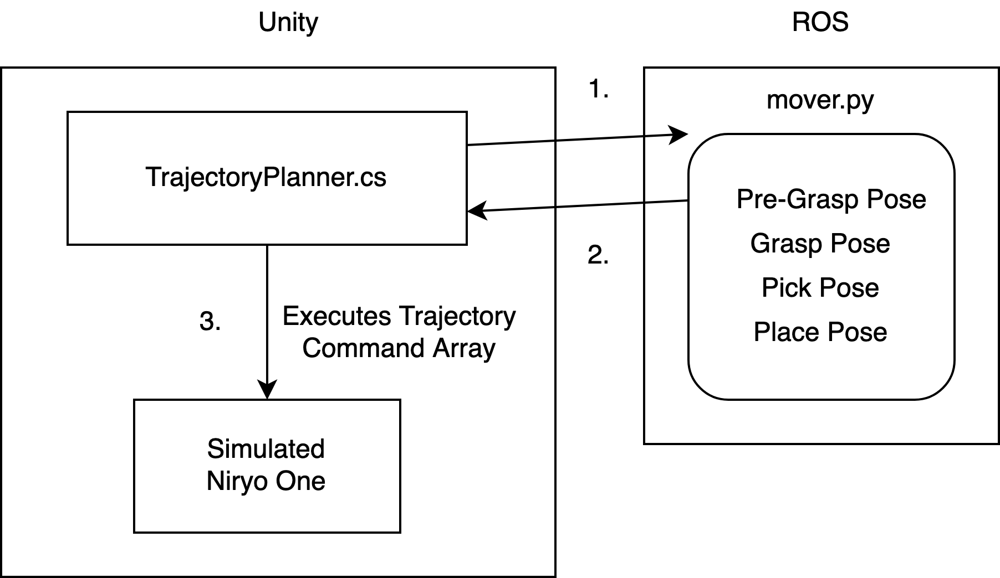
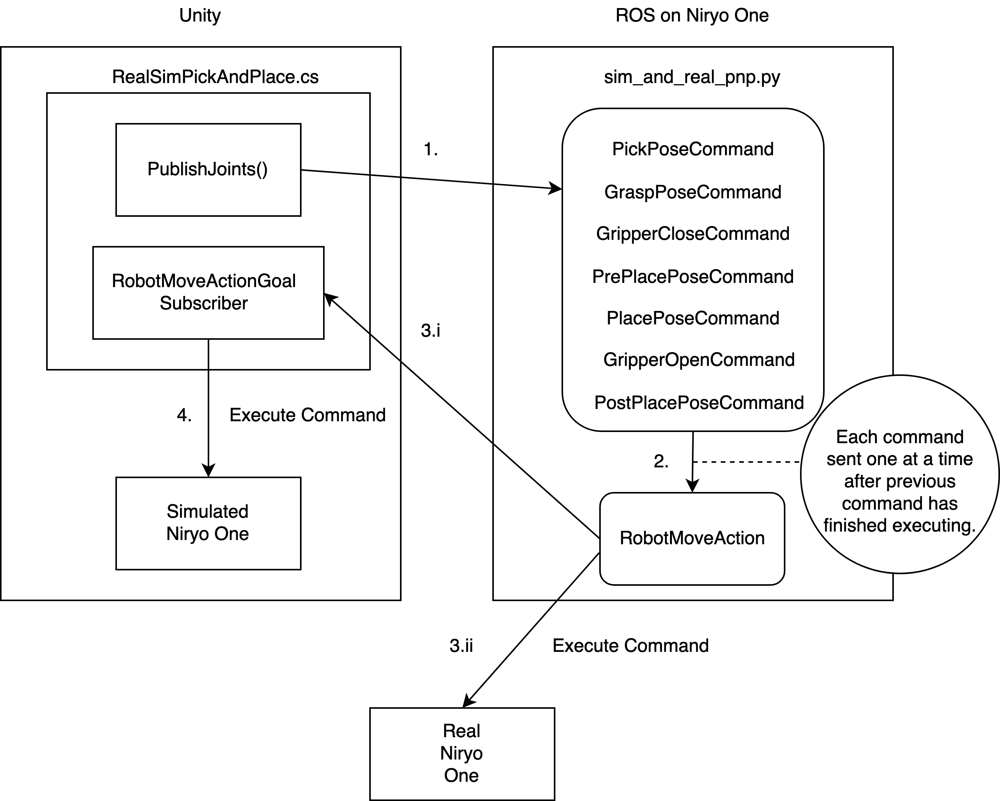
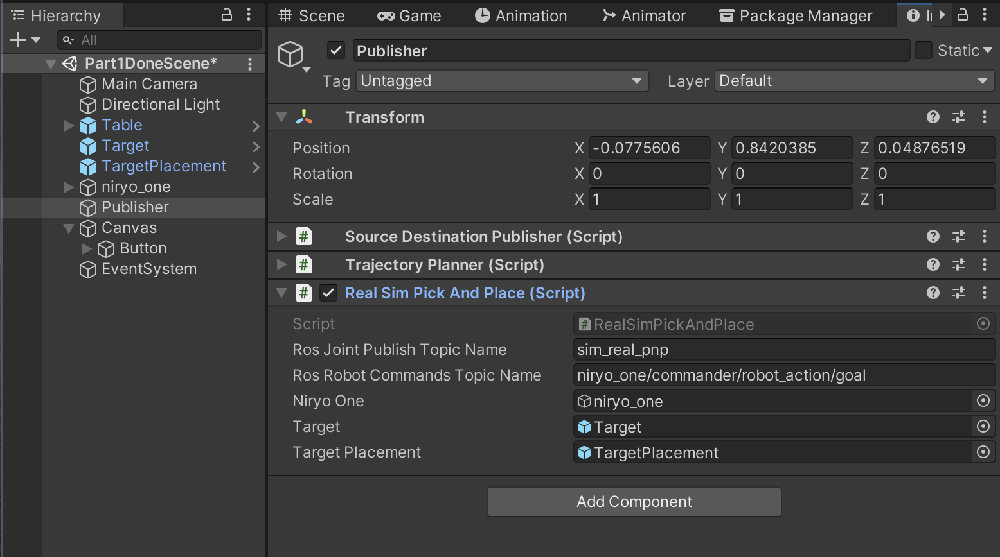
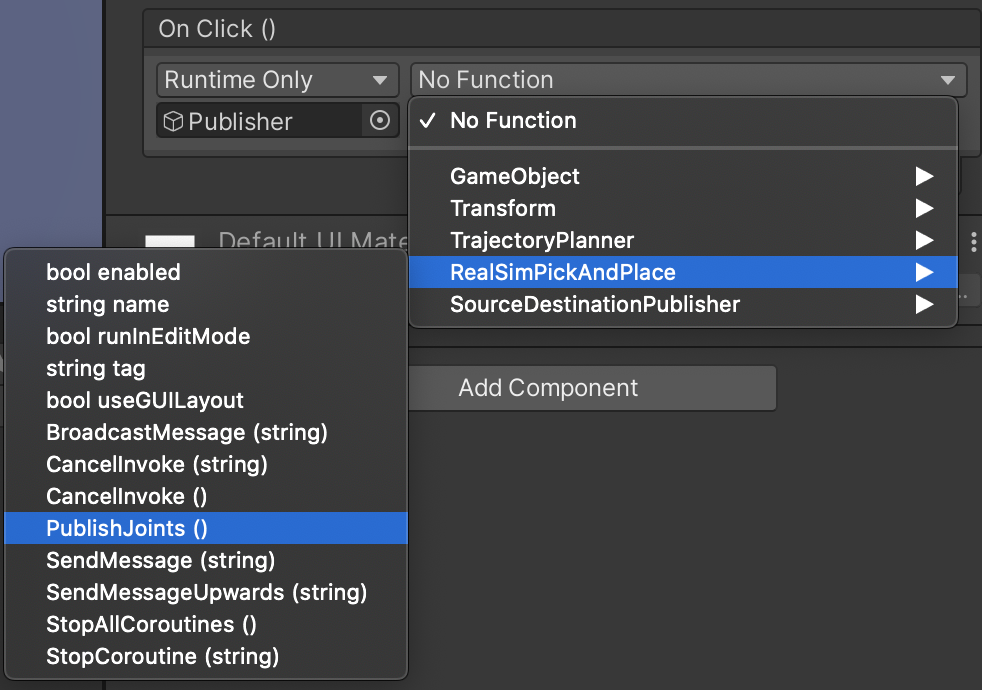

# Pick-and-Place Tutorial: Part 4

This part is going to be a little different than the previous tutorials in that it will utilize a real Niryo One robot. Although we assume you have completed the previous three parts ([Part 1](1_urdf.md), [Part 2](2_ros_tcp.md), [Part 3](3_pick_and_place.md)), we do not assume that you have access to a Niryo One outside of simulation. As such this tutorial should mostly be used as a reference for how to simulate the behaviour of a robot operating in real life.

**Table of Contents**

  - [Niryo One Information](#niryo-one-information)
  	- [RobotMoveGoal Parameters](#robotmovegoal-parameters)
  - [Differences From Part 3](#differences-from-part-3)
  - [The ROS Side](#the-ros-side)
  - [The Unity Side](#the-unity-side)
  	- [Key Differences](#key-differences)
  	- [Setting Up The Unity Scene](#setting-up-the-unity-scene)
  - [Setting Up Niryo One](#setting-up-niryo-one)
  	- [Update Niryo One URDFs](#update-niryo-one-urdfs)
  	- [Add niryo_moveit Package](#add-niryo_moveit-package)
  - [Execution](#execution)

  
# Niryo One Information

The best source of information for the Niryo One is the [User Manual](https://niryo.com/docs/niryo-one/user-manual/complete-user-manual/). It contains a lot of general information about the Niryo One, such as how to connect it to a network, how to log in to it, and how to use the Niryo One Studio desktop application.

> NOTE: The Niryo One will need to be connected to the same network as the machine running the Unity Editor.

For this tutorial we will be using the full [Niryo One ROS stack](https://niryo.com/docs/niryo-one/developer-tutorials/get-started-with-the-niryo-one-ros-stack/) running on the Niryo One robot.

From the Niryo One ROS documentation:
> The commander package exposes an action server named “niryo_one/commander/robot_action”, with a “RobotMoveCommand” message. This is probably what you’re looking for if you want to send direct command to the robot using ROS.

Using the `RobotMoveCommand` action server we can write an [action client](http://wiki.ros.org/actionlib_tutorials/Tutorials/Writing%20a%20Simple%20Action%20Client%20%28Python%29) that sends `RobotMoveGoal` commands to the Niryo One for execution.

> If you are unfamiliar with ROS actions you can read more about them [here](http://wiki.ros.org/actionlib).

> Commands can also be executed on the Niryo One by publishing `RobotMoveActionGoal` messages directly to the `niryo_one/commander/robot_action/goal` topic. However, the default behavior of the action server allows only one action to be executed at a time, so any new actions received by the action server will replace any currently executing actions.

## RobotMoveGoal Parameters

The `goal` section in the `niryo_one_msgs/action/RobotMove.action` file shows a single field, `RobotMoveCommand`. Then looking at the `RobotMoveCommand` message we see that it is used as a catchall for executing a variety of commands on the robot.

### RobotMoveGoal.RobotMoveCommand

Since we are only interested in executing trajectory and gripper commands we will only focus on the following parameters:

- `int32 cmd_type`
	- Which type of robot command to execute, trajectory or tool command
- `niryo_one_msgs/TrajectoryPlan Trajectory`
	- The trajectory to be executed
- `niryo_one_msgs/ToolCommand tool_cmd`
	- The end effector command to be executed

Since the `cmd_type` variable is used to determine which command in the `RobotMoveCommand` message is to be executed, we will need to find the appropriate values to execute trajectory or tool commands.

We can find this information in the `niryo_one_ros/niryo_one_commander/src/niryo_one_commander/command_type.py` file:

```python
JOINTS = 1
POSE = 2
POSITION = 3
RPY = 4
SHIFT_POSE = 5
TOOL = 6
EXECUTE_TRAJ = 7
POSE_QUAT = 8
SAVED_POSITION = 9
SAVED_TRAJECTORY = 10
```

We can see that the `cmd_type` variable in `RobotMoveCommand` will need to be `7` to execute a trajectory and `6` to execute a tool command.

### RobotMoveGoal.RobotMoveCommand.ToolCommand

To execute an end effector command on the Niryo One, a `ToolCommand` object is required. Much like `RobotMoveCommand`, the `ToolCommand` message type is a catch all for gripper commands as the Niryo One supports a variety of [grippers](https://niryo.com/niryo-one-accessories/).

We are only interested in opening and closing the standard gripper so we will only use the following parameters:

- `uint8 tool_id`
	- Which end effector is being used
- `uint8 cmd_type`
	- Which command to execute. Ex. open or close
- `uint16 gripper_close_speed`
	- How fast should the gripper close
- `uint16 gripper_open_speed`
	- How fast should the gripper open

The `tool_id`s are stored in `niryo_one_ros/niryo_one_bringup/config/v2/niryo_one_motors.yaml`

```yaml
dxl_authorized_motors: # here include all Dynamixel tools that can possibly be attached to Niryo One
    - 2 # -> id of Axis 4
    - 3 # -> id of Axis 5
    - 6 # -> id of Axis 6
    - 11 # id of Gripper 1
    - 12 # id of Gripper 2
    - 13 # id of Gripper 3
    - 31 # if of Vacuum Pump 1
```

We are using the standard gripper which has an id of 11.

Just like the `cmd_type` parameter in `RobotMoveCommand` we will need to look at `niryo_one_ros/niryo_one_tools/config/end_effectors.yaml` to find the appropriate values to use.

```yaml
command_list:
    # Gripper
    open_gripper: 1
    close_gripper: 2
    # Vacuump pump
    pull_air_vacuum_pump: 10
    push_air_vacuum_pump: 11
    # Tools controlled by digital I/Os
    setup_digital_io: 20
    activate_digital_io: 21
    deactivate_digital_io: 22

```

From here we see that the `RobotMoveGoal.RobotMoveCommand.ToolCommand.cmd_type` variable will need to be `2` to close the gripper and `1` to open it. 


# Differences From Part 3

**Part 3  - Purely Simulated - Flow:**



1. In part 3, we had `TrajectoryPlanner` send a MoverServiceRequest message on the `niryo_moveit` topic. The message contained the robot pose, target cube coordinates, and target destination coordinates
1. `mover.py` received the message, calculated the four trajectories, added them to an array, and sent back the array in a MoverServiceResponse message to `TrajectoryPlanner`.
1. `TrajectoryPlanner` then executed the trajectories one at a time on the simulated Niryo One.

**Part 4 - Simulated and Real - Flow:**



1. Now, `RealSimPickAndPlace.cs` will publish robot pose, target cube coordinates, and target destination coordinates to `sim_real_pnp` topic.
1. `sim_and_real_pnp.py` will recieve the message, plan the trajectories, and send the action goals one at a time to the `RobotMove` action server.


1. **Simultaneously**
	1. The `RobotMove` action server will publish the goal messages along to the `robot_action/goal` topic.
	1. The `RobotMove` action server will execute the trajectory on Niryo One.

1. The simulated Niryo One, `RealSimPickAndPlace.cs`, subscriber will read from `robot_action/goal`, and execute the same commands.

**Note the changes between Part 3 and Part 4::**

- The `MoverService`, `mover.py`,  has been replaced with a ROS Subscriber in `sim_and_real_pnp.py` but retains the trajectory-planning capability.
- An action server, RobotMove, has been introduced to schedule and execute trajectories.
- Gripper command execution was previously hard-coded in `TrajectoryPlanner.cs` in part 3 but is now being managed by the `RobotMove` action server.
- Extra poses have been added to make execution of the individual poses more apparent on the physical robot.


# The ROS Side
There are two lines that have not been previously used in `server_endpoint.py` that we will now be using.

- The following line will be used by the simulated Niryo One in our Unity scene to read from the `robot_action/goal` topic and execute the same trajectories as the real Niryo One.
```python
'niryo_one/commander/robot_action/goal': RosSubscriber('niryo_one/commander/robot_action/goal', RobotMoveActionGoal, tcp_server),
```

- We will be reusing the `MoverServiceRequest` message type to publish the target and target destination poses to ROS from Unity.
```python
'sim_real_pnp': RosPublisher('sim_real_pnp', MoverServiceRequest)
```

We will also make use of the `sim_and_real_pnp.py` script. It is very similar to `mover.py` used in the previous tutorial with some minor differences.

- Instead of a ROS Service this node is a ROS Subscriber that uses a ROS ActionClient to send goals.

- Two functions have been added to handle the creation of the RobotMoveActionGoal messages.

	- To send a trajectory command:

	```python
	def send_trajectory_goal(client, trajectory):
	
	    # Build the goal
	    goal = RobotMoveGoal()
	    goal.cmd.Trajectory = trajectory
	    goal.cmd.cmd_type = TRAJECTORY_COMMAND_ID
	
	    client.send_goal(goal)
	    client.wait_for_result()
	
	    return
	```

	- To send a gripper command:
	
	```python
	def send_tool_goal(client, gripper_command):
	    tool_command = ToolCommand()
	    tool_command.tool_id = TOOL_ID
	    tool_command.cmd_type = gripper_command
	    tool_command.gripper_open_speed = GRIPPER_SPEED
	    tool_command.gripper_close_speed = GRIPPER_SPEED
	
	    goal = RobotMoveGoal()
	    goal.cmd.tool_cmd = tool_command
	    goal.cmd.cmd_type = TOOL_COMMAND_ID
	
	    client.send_goal(goal)
	    client.wait_for_result()
	
	    return
	```

- The `pick_and_place` function has been updated to call the two previous functions instead of appending the trajectory or gripper command to a list.

	- Example from `mover.py`
	
	```python
	    previous_ending_joint_angles = grasp_pose.joint_trajectory.points[-1].positions
	    response.trajectories.append(grasp_pose)
	```
	
	- Updated code in `sim_real_pnp.py`
	
	```python
	    previous_ending_joint_angles = grasp_pose.trajectory.joint_trajectory.points[-1].positions
	    send_trajectory_goal(client, grasp_pose)
	```

# The Unity Side
Using the same scene from [Part 3](3_pick_and_place.md), we are going to use a new script, `RealSimPickAndPlace.cs`, that mirrors a lot of the functionality of the `TrajectoryPlanner.cs` script. 


## Key Differences
Instead of calling a service and waiting for the response  to execute a robot command, we will subscribe to the `niryo_one/commander/robot_action/goal` topic and execute each command we receive.

- A subscriber is created on Start to read the robot command messages and execute them as they are received.

```csharp
void Start()
{
    ros.Subscribe<RobotMoveActionGoal>(rosRobotCommandsTopicName, ExecuteRobotCommands);
}
```

- The subscriber callback mimics the robot commander code in the Niryo One ROS stack and determines whether a trajectory or tool command was issued.

```csharp
    void ExecuteRobotCommands(RobotMoveActionGoal robotAction)
    {
        if (robotAction.goal.cmd.cmd_type == TRAJECTORY_COMMAND_EXECUTION)
        {
            StartCoroutine(ExecuteTrajectories(robotAction.goal.cmd.Trajectory.trajectory));
        }
        else if (robotAction.goal.cmd.cmd_type == TOOL_COMMAND_EXECUTION)
        {
            if (robotAction.goal.cmd.tool_cmd.cmd_type == OPEN_GRIPPER)
            {
                Debug.Log("Open Tool Command");
                OpenGripper();
            }
            else if (robotAction.goal.cmd.tool_cmd.cmd_type == CLOSE_GRIPPER)
            {
                Debug.Log("Close Tool Command");
                CloseGripper();
            }
        }
    }
```

- The ExecuteTrajectories function has been updated to accept a single RobotTrajectory object and execute the robot poses one at a time:

```csharp
    private IEnumerator ExecuteTrajectories(RobotTrajectory trajectories)
    {
        // For every robot pose in trajectory plan
        foreach (var point in trajectories.joint_trajectory.points)
        {
            var jointPositions = point.positions;
            float[] result = jointPositions.Select(r=> (float)r * Mathf.Rad2Deg).ToArray();
            
            // Set the joint values for every joint
            for (int joint = 0; joint < jointArticulationBodies.Length; joint++)
            {
                var joint1XDrive  = jointArticulationBodies[joint].xDrive;
                joint1XDrive.target = result[joint];
                jointArticulationBodies[joint].xDrive = joint1XDrive;
            }
            // Wait for robot to achieve pose for all joint assignments
            yield return new WaitForSeconds(JOINT_ASSIGNMENT_WAIT);
        }
    }
```


- The `PublishJoints()` function's only change is that the message is published to a topic instead of being sent as a ServiceMessage.

`ros.Send(rosJointPublishTopicName, request);`


## Setting Up The Unity Scene
1. In Unity, Select Robotics -> ROS Settings from the top menu bar and update the ROS IP Address to that of the Niryo One.

1. Select the Publisher GameObject and add the `RealSimPickAndPlace` script as a component.

1. Note that the RealSimPickAndPlace component shows its member variables in the Inspector window, which need to be assigned. 

    Once again, drag and drop the `Target` and `TargetPlacement` objects onto the Target and Target Placement Inspector fields, respectively. Assign the `niryo_one` robot to the Niryo One field. 

    

1. Select the previously made Button object in Canvas/Button, and scroll to see the Button component. Under the `OnClick()` header, click the dropdown where it is currently assigned to the SourceDestinationPublisher.Publish(). Replace this call with RealSimPickAndPlace > `PublishJoints()`.

    

1. The Unity side is now ready to communicate with ROS on the Niryo One!


# Setting Up Niryo One

> An easy way to find the Niryo One's IP address is to connect to it using the Niryo One Studio application

## Update Niryo One URDFs
> The world-space origin of the Niryo One is defined in its URDF file. The provided Niryo One URDF used in the previous tutorials has already been updated to reflect the position of the simulated Niryo One situated on top of the table. In order to have accurate trajectory planning the URDF files on the real Niryo One will need to be updated to reflect the simulated robot's position.

- The two files that will need to be updated are `niryo_one.urdf.xacro`  and `without_mesh_niryo_one.urdf.xacro` located in the `/home/niryo/catkin_ws/src/niryo_one_description/urdf/v2` directory.
	- Look for the joint named `joint_world` and update the `origin`'s `xyz` to `0 0 0.63` to reflect that the simulated Niryo is placed at `0.63` on the Z axis.
	
	```xml
	    <joint name="joint_world" type="fixed">
	        <parent link="world" />
	        <child link="base_link" />
	        <origin xyz="0 0 0.63" rpy="0 0 0" />
	    </joint>
	```

## Add niryo_moveit Package
The Niryo One ROS stack is already installed on the robot and only the `niryo_moveit` package will need to be added.

1. Update the `niryo_moveit/config/params.yml` file's `ROS_IP` parameter to match that of the Niryo One.

1. Copy the `niryo_moveit` package to the `catkin_ws` directory on the Niryo One's catkin workspace at `/home/niryo/catkin_ws` and run the `catkin_make` command.

> Using the SCP command to transfer the `niryo_moveit` package might look something like, `scp -r ~/PATH/TO/niryo_moveit niryo@NIRYO_IP_ADDRESS:/home/niryo/catkin_ws/src`

# Execution
1. Use the `part_4.launch` file to setup the ROS params and start the `server_endpoint` and `sim_real_pnp` scripts.
	- `roslaunch niryo_moveit part_4.launch`

1. Return to the Unity Editor and press Play. Press the UI Button to send the joint configurations to ROS on the Niryo One, and watch the robot arm move simultaneously in simulation and real life!


