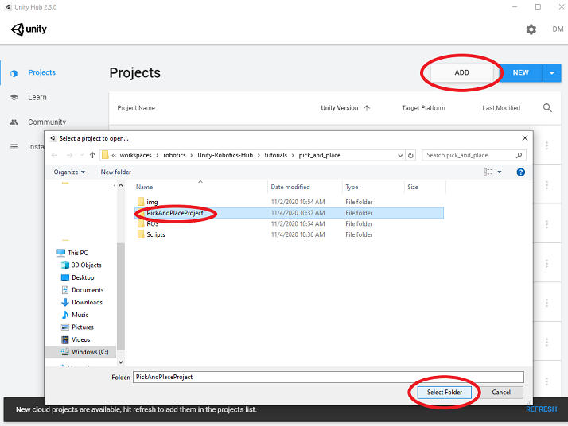

# Pick-and-Place Tutorial: Quick Demo

This part uses scripts to automatically setup and run the Niryo One pick-and-place demo in Unity Editor.

**Table of Contents**
  - [Prerequisite](#prerequisite)
  - [Start ROS](#setting-up-ros)
  - [Start Demo](#start-demo)
  - [Proceed to Part 1](#proceed-to-part-1)

## Prerequisite

1. Clone this repo to a location on your local machine:
    ```bash
    git clone --recurse-submodules https://github.com/Unity-Technologies/Unity-Robotics-Hub.git
    ```

1. Install [Docker Engine](https://docs.docker.com/engine/install/)

1. Install [Unity Hub](https://unity3d.com/get-unity/download).

1. Go to the [Unity 2020.2 Beta website](https://unity3d.com/unity/beta/2020.2.0b9) to install this project's version of Unity: **2020.2.0b9**. 

## Start ROS

1. Build the ROS docker image

  ```bash
  cd /YOUR/UNITY-ROBOTICS-HUB/REPOSITORY/tutorials/pick_and_place &&
  git submodule update --init --recursive &&
  docker build -t unity-robotics:pick-and-place -f docker/Dockerfile .
  ```

1. Run ROS in a new docker container

  ```bash
  docker run -it --rm -p 10000:10000 -p 5005:5005 unity-robotics:pick-and-place part_3 /bin/bash
  ```

## Start Demo

1. Open Unity Hub and click the "Add" button in the top right of the "Projects" tab on Unity Hub, and navigate to and select the PickAndPlaceProject directory (`./Unity-Robotics-Hub/tutorials/pick_and_place/PickAndPlaceProject/`) to add the tutorial project to your Hub.

   

1. Click the newly added project to open it.

1. Unity should open the project to a scene titled `EmptyScene`. You can find the `DemoScene` in the Project browser in the Assets/Scenes directory, and double-click to open it.

1. Click `Play` button to watch the full demo.

### Proceed to [Part 1](1_urdf.md).
