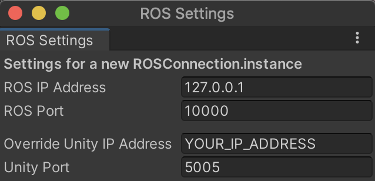
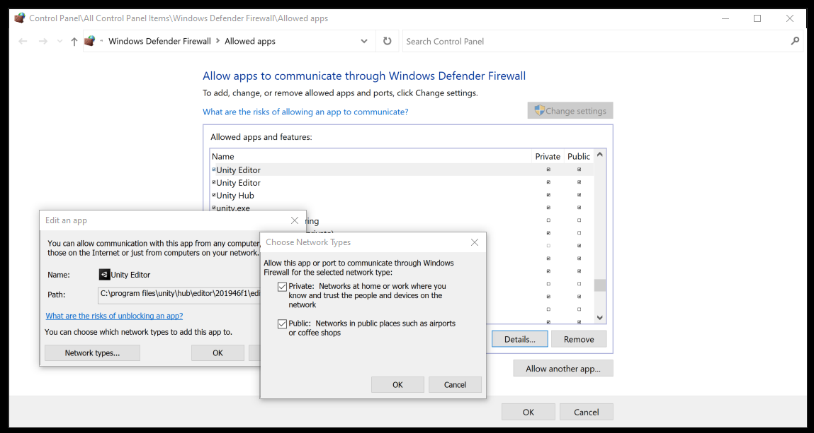

# ROS–Unity Integration Networking

## Table of Contents
- [Definitions](#definitions)
- [Communicaton Minimum Requirements](#communication-minimum-requirements)
	- [If Using Docker](#if-using-docker)
	- [Explicitly Setting UNITY_IP](#explicitly-setting-unity_ip)
- [Troubleshoooting](#troubleshooting)
	- [Where Does Communication Break Down](#where-does-communication-break-down)
		- [1. Can Unity send messages to ROS?](#1-can-unity-send-messages-to-ros)
		- [2. Can ROS send messages to Unity?](#2-can-ros-send-messages-to-unity)
	- [Open Port on Windows Firewalll](#open-port-on-windows-firewall)

# Definitions

`ROS_IP` : The IP address of the machine, VM, or container running ROS.

`UNITY_IP` : The IP address of the machine running Unity.

> It is possible to set both of these variables on the machines running Unity and ROS. The specifics of where and why each of these settings will be described below.

On the ROS machine these settings are set as a rosparam and will typically be set in a launch file like [this](https://github.com/Unity-Technologies/Unity-Robotics-Hub/blob/main/tutorials/ros_packages/robotics_demo/launch/robo_demo.launch) or in a [param file](https://github.com/Unity-Technologies/Unity-Robotics-Hub/blob/main/tutorials/pick_and_place/ROS/src/niryo_moveit/config/params.yaml) loaded by a launch file like [this](https://github.com/Unity-Technologies/Unity-Robotics-Hub/blob/main/tutorials/pick_and_place/ROS/src/niryo_moveit/launch/part_3.launch#L2). The param file can also be loaded manually by running the `rosparam load params.yaml` command.

On the Unity machine these settings are set from the menu by going to `Robotics` -> `ROS Settings`


# Communication Minimum Requirements

The minimum settings required for Unity to communicate with ROS is to set the `ROS_IP` on the ROS side in a launch file and on the Unity side in `Robotics` -> `ROS Settings`.

## If Using Docker

The container will need to be started with the following arguments to forward the ports used for communication between ROS and Unity. 

`-p 10000:10000 -p 5005:5005`


- On the ROS side, set `ROS_IP` to `0.0.0.0`.

- On the Unity side, set `ROS_IP` to `127.0.0.1` and the `Override Unity IP Address` to your local machine's IP address.



## Explicitly setting `UNITY_IP`

The `UNITY_IP` can be set in two different places.

1. If set on the ROS side as a rosparam, the `server_endpoint` will only use this IP to send messages to Unity.
1. If set on the Unity side as the `Override Unity IP Address`, the `UNITY_IP` on the ROS side will be set to this value during the initial handshake between ROS and Unity once play is pressed in the Editor.

> If the `UNITY_IP` is not set in either of these places, then the IP that makes the first connection to ROS during the initial handshake will be used.

# Troubleshooting

## Where Does Communication Break Down

### 1. Can Unity send messages to ROS?

When play is pressed in the Editor, a handshake message is sent from Unity to ROS.

If Unity can communicate with ROS, the following message should be printed to the console screen running the `server_endpoint.py` script.

```[UnityTcpSender]: ROS-Unity Handshake received, will connect to UNITY_IP_ADDRESS:5005```

With the corresponding response message printed to the Unity console,

```ROS-Unity server listening on UNITY_IP_ADDRESS:5005```


If the previous message is not shown and either of the following errors are thrown instead:

```
SocketException: A connection attempt failed because the connected party did not respond after a period of time, or established connection failed because connected host has failed to respond.
```

```
SocketException: Connection refused
```

Confirm that:

- `server_endpoint` is running
- You can ping ROS machine from Unity machine
	- From a terminal on the Unity machine, run the following command to confirm whether the ROS machine is reachable over the network. ```ping ROS_IP```

If issue still persists:

- Confirm your IP addresses
- If on Windows you may need to [open ports for the firewall](#open-port-on-windows-firewall).

### 2. Can ROS send messages to Unity?

After it is confirmed that Unity can communicate with ROS, publish a message to a ROS topic to which Unity has instantiated a subscriber.

If an error is thrown in the `server_endpoint` console then ROS cannot connect to Unity.

If issue still persists:

- Confirm your IP addresses
- Explicitly set the `UNITY_IP`
- If on Windows you may need to [open ports for the firewall](#open-port-on-windows-firewall).

## Open port on Windows Firewall
- Open port in Windows Firewall by opening `Windows Defender Firewall` then selecting `Action` -> `New Rule...`
	- Port `10000` will need to be added as an outbound rule
	- Port `5005` will need to obe added as an inbound rule


In some instances opening a port did not resolve the communication issues and the Unity Editor had to be allowed through the firewall

- Allow the Editor through the firewall by opening `Windows Defender Firewall` -> `Allowed Apps` and then modifying the settings for the Unity Editor to allow communication on private and public networks.




